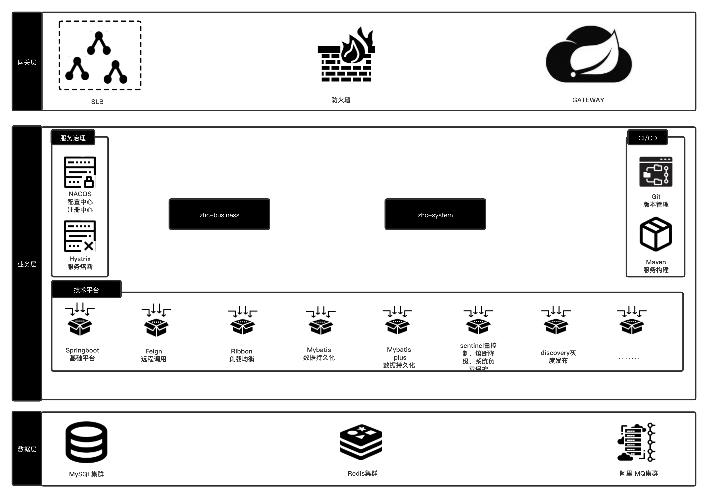

# springcloud

## 1. 项目介绍
spring Cloud项目搭建，无具体业务。

## 2. 项目总体架构图


## 3. 功能介绍
* **分布式系统基础支撑**
    * 服务注册发现、路由与负载均衡
    * 服务降级与熔断
    * nacos配置注册中心
    * 分布式锁
## 4. 模块说明
```lua
springcloud -- 父项目，公共依赖
│  ├─zhc-business -- 业务模块
│  │  ├─zhc-business-api -- 接口
│  │  ├─zhc-business-domain -- 数据库操作
│  │  ├─zhc-business-service -- 业务层
│  │  ├─zhc-business-start -- 启动类
│  │  ├─zhc-business-web -- 接口入口 conteoller
│  ├─zhc-system -- system模块
│  │  ├─zhc-system-api -- 接口
│  │  ├─zhc-system-domain -- 数据库操作
│  │  ├─zhc-system-service -- 业务层
│  │  ├─zhc-system-start -- 启动类
│  │  ├─zhc-system-web -- 接口入口 conteoller
│  ├─zhc-gateway -- api网关工程
│  ├─zhc-common -- 通用依赖
│  ├─zhc-boot-starters -- 封装的starter
│  │  ├─zhc-spring-boot-starter -- springboot starter
│  │  ├─zhc-db-nacos-mybatis-plus-starter -- 封装数据库通用操作逻辑（可用nacos动态修改数据库连接账号密码等）
│  │  ├─zhc-nacos-spring-boot-starter
│  │  ├─zhc-nacos-spring-cloud-starter -- naocs springcloud
│  │  ├─zhc-discovery-gateway-spring-cloud-starter -- 封装gatewa discovery
│  │  ├─zhc-sentinel-gateway-spring-cloud-starter -- 封装gatewa sentinel
│  │  ├─zhc-discovery-service-spring-cloud-starter -- 封装service discovery
│  │  ├─zhc-sentinel-service-spring-cloud-starter -- 封装service sentinel
│  │  ├─zhc-redis-nacos-spring-boot-starter -- 封装redis通用操作逻辑（可用nacos动态修改redis连接账号密码等）
```